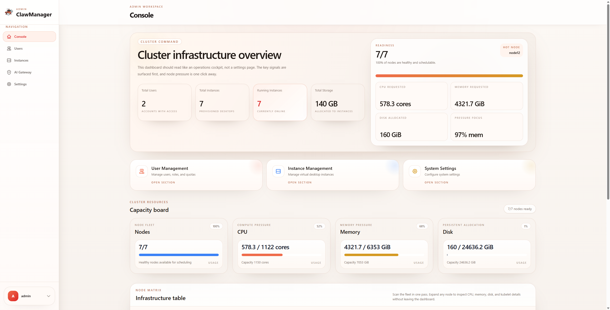
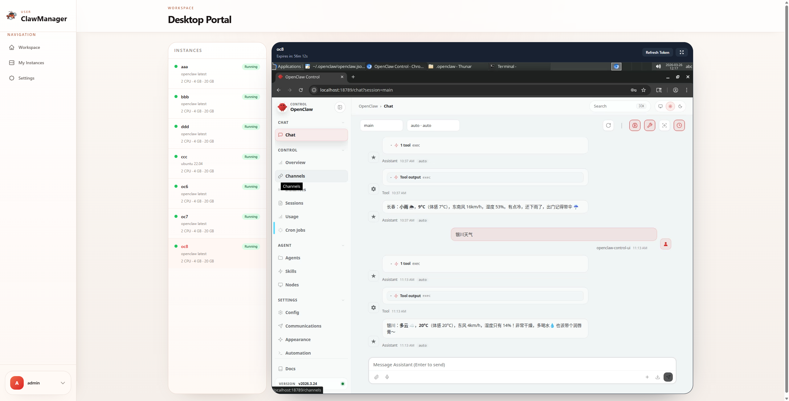
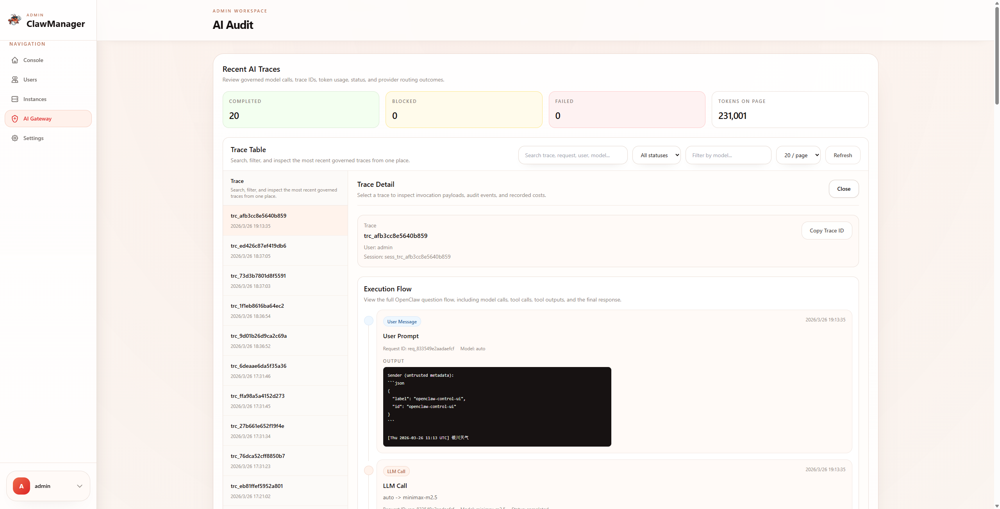

# ClawManager

<p align="center">
  
</p>

<p align="center">
  Eine Kubernetes-first-Kontrollplattform zur zentralen Verwaltung von OpenClaw- und Linux-Desktop-Runtimes fuer Teams und Cluster im grossen Massstab.
</p>

<p align="center">
  <strong>Sprachen:</strong>
  <a href="./README.md">English</a> |
  <a href="./README.zh-CN.md">简体中文</a> |
  <a href="./README.ja.md">日本語</a> |
  <a href="./README.ko.md">한국어</a> |
  Deutsch
</p>

<p align="center">
  
  
  
  
  
</p>

## News

- `2026-03-26`: Die AI-Gateway-Dokumentation und Uebersicht wurden aktualisiert, inklusive Modell-Governance, Audit-Trace, Kostenrechnung und Risikokontrolle. Siehe [AI Gateway](#ai-gateway).

<p align="center">
  
  
  
</p>

## Was Es Ist

ClawManager hilft Teams dabei, Desktop-Runtimes auf Kubernetes zentral zu deployen, zu betreiben und darauf zuzugreifen.

Es ist fuer Umgebungen gedacht, in denen:

- Desktop-Instanzen fuer mehrere Benutzer erstellt werden muessen
- Quotas, Images und Lebenszyklen zentral verwaltet werden sollen
- Desktop-Dienste innerhalb des Clusters bleiben sollen
- sicherer Browser-Zugriff ohne direkte Pod-Freigabe gebraucht wird

## Warum Nutzer Es Waehlen

- Ein Admin-Panel fuer Benutzer, Quotas, Instanzen und Runtime-Images
- OpenClaw-Unterstuetzung mit Import und Export von Speicher und Einstellungen
- Sicherer Desktop-Zugriff ueber die Plattform statt direkter Service-Freigabe
- AI Gateway fuer kontrollierten Modellzugriff, Audit-Trails, Kostenanalyse und Risikokontrolle
- Kubernetes-naher Deployment- und Betriebsablauf
- Geeignet sowohl fuer zentral gesteuerte Rollouts als auch fuer Self-Service-Erstellung

## Schnellstart

### Voraussetzungen

- Ein funktionierender Kubernetes-Cluster
- `kubectl get nodes` funktioniert

### Deployment

Das mitgelieferte Manifest direkt anwenden:

```bash
kubectl apply -f deployments/k8s/clawmanager.yaml
kubectl get pods -A
kubectl get svc -A
```

## Aus Dem Quellcode Bauen

Wenn du ClawManager aus dem Quellcode starten oder paketieren moechtest, statt das mitgelieferte Kubernetes-Manifest zu verwenden:

### Frontend

```bash
cd frontend
npm install
npm run build
```

### Backend

```bash
cd backend
go mod tidy
go build -o bin/clawreef cmd/server/main.go
```

### Docker-Image

Das komplette Applikations-Image im Repository-Root bauen:

```bash
docker build -t clawmanager:latest .
```

### Standardkonten

- Standard-Admin-Konto: `admin / admin123`
- Standardpasswort fuer importierte Admin-Benutzer: `admin123`
- Standardpasswort fuer importierte regulaere Benutzer: `user123`

### Erste Schritte

1. Als Administrator anmelden.
2. Benutzer erstellen oder importieren und Quotas vergeben.
3. Runtime-Image-Karten in den Systemeinstellungen pruefen oder aktualisieren.
4. Als normaler Benutzer anmelden und eine Instanz erstellen.
5. Ueber Portal View oder Desktop Access auf den Desktop zugreifen.

## Hauptfunktionen

- Instanz-Lifecycle-Management: erstellen, starten, stoppen, neu starten, loeschen, anzeigen und synchronisieren
- Unterstuetzte Runtimes: `openclaw`, `webtop`, `ubuntu`, `debian`, `centos`, `custom`
- Runtime-Image-Kartenverwaltung im Admin-Panel
- Benutzerbezogene Quota-Kontrolle fuer CPU, Speicher, Storage, GPU und Instanzanzahl
- Cluster-Ressourcenuebersicht fuer Nodes, CPU, Speicher und Storage
- Tokenbasierter Desktop-Zugriff mit WebSocket-Weiterleitung
- AI Gateway fuer Modellverwaltung, nachvollziehbare Audit-Logs, Kostenrechnung und Risikokontrolle
- CSV-basierter Massenimport von Benutzern
- Mehrsprachige Oberflaeche

## AI Gateway

AI Gateway ist die Governance-Ebene fuer den Modellzugriff in ClawManager. Es bietet OpenClaw-Instanzen einen einheitlichen OpenAI-kompatiblen Einstiegspunkt und ergaenzt Upstream-Provider um Richtlinien, Audit und Kostenkontrolle.

- Modellverwaltung fuer regulaere und sichere Modelle sowie Provider-Anbindung, Aktivierung, Endpoint-Konfiguration und Preisrichtlinien
- End-to-End-Audit- und Trace-Aufzeichnungen fuer Requests, Responses, Routing-Entscheidungen und Risiko-Treffer
- Eingebaute Kostenrechnung mit Token-Erfassung und Nutzungsschaetzung
- Risikokontrolle ueber konfigurierbare Regeln mit automatischen Aktionen wie `block` und `route_secure_model`

Screenshots, die komplette Funktionsaufstellung und den Ablauf der Modellwahl und des Routings findest du in [docs/aigateway.md](./docs/aigateway.md).

## Produktablauf

1. Ein Administrator definiert Benutzer, Quotas und Runtime-Image-Richtlinien.
2. Ein Benutzer erstellt eine OpenClaw- oder Linux-Desktop-Instanz.
3. ClawManager erstellt und verfolgt die Kubernetes-Ressourcen.
4. Der Benutzer greift ueber die Plattform auf den Desktop zu.
5. Administratoren ueberwachen Zustand und Kapazitaet ueber das Dashboard.

## Architektur

```text
Browser
  -> ClawManager Frontend
  -> ClawManager Backend
  -> MySQL
  -> Kubernetes API
  -> Pod / PVC / Service
  -> OpenClaw / Webtop / Linux Desktop Runtime
```

## Konfigurationshinweise

- Instanz-Services laufen im internen Kubernetes-Netzwerk
- Desktop-Zugriff geht ueber den authentifizierten Backend-Proxy
- Runtime-Images koennen in den Systemeinstellungen ueberschrieben werden
- Das Backend sollte idealerweise innerhalb des Clusters deployt werden

Wichtige Backend-Umgebungsvariablen:

- `SERVER_ADDRESS`
- `SERVER_MODE`
- `DB_HOST`
- `DB_PORT`
- `DB_USER`
- `DB_PASSWORD`
- `DB_NAME`
- `JWT_SECRET`

### CSV-Importvorlage

```csv
Username,Email,Role,Max Instances,Max CPU Cores,Max Memory (GB),Max Storage (GB),Max GPU Count (optional)
```

Hinweise:

- `Email` ist optional
- `Max GPU Count (optional)` ist optional
- alle anderen Spalten sind erforderlich

## Lizenz

Dieses Projekt ist unter der MIT License veroeffentlicht.

## Open Source

Issues und Pull Requests sind willkommen.
