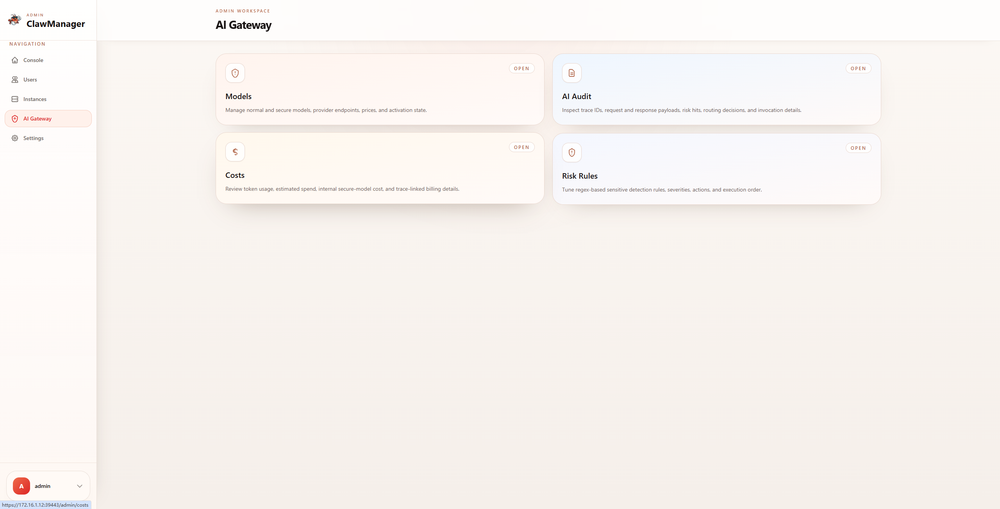
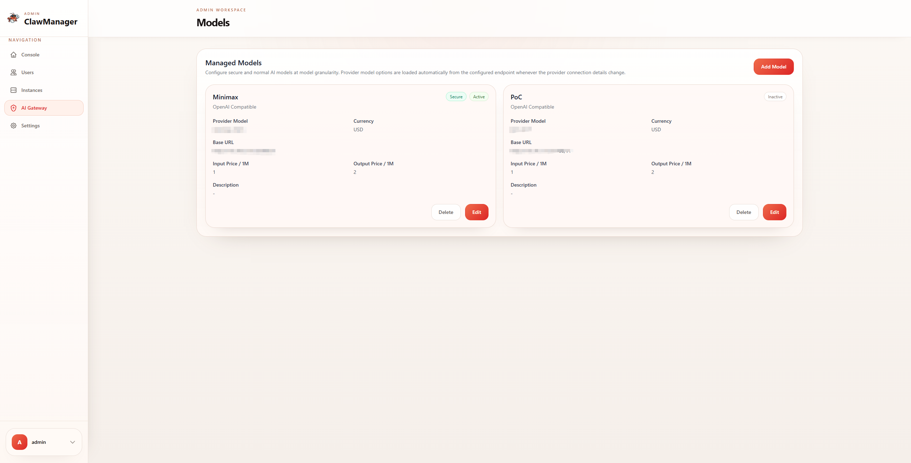
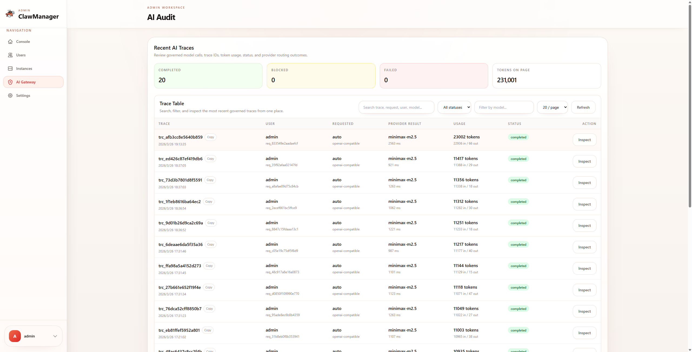
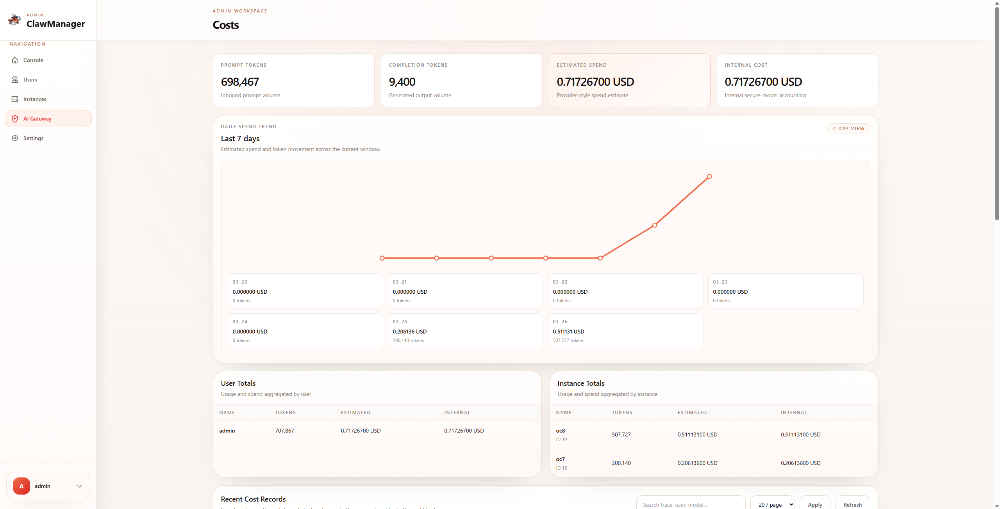
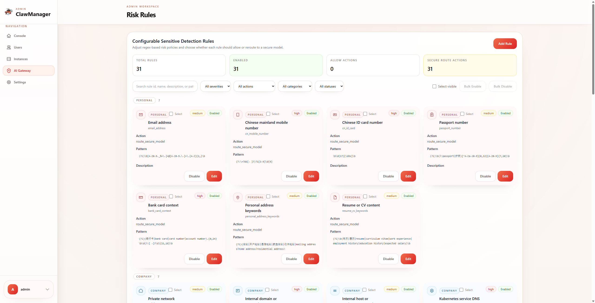
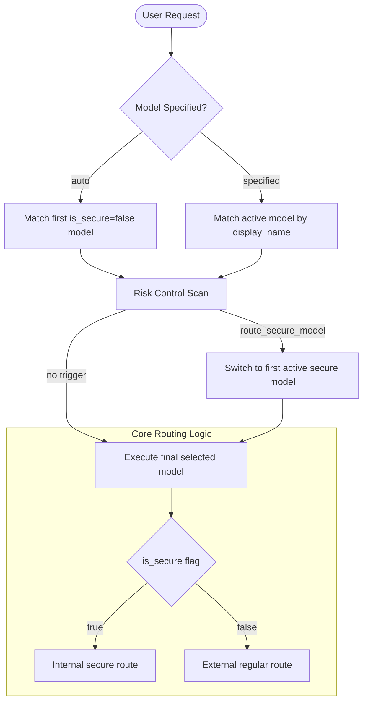

## AI Gateway

AI Gateway is the core governance plane in ClawManager for OpenClaw instances. It provides a controlled, secure, and auditable model access layer that hides provider-specific differences behind a single interface, while adding compliance controls and cost visibility on top.

### 1. Model Management

AI Gateway applies fine-grained model governance so users can access only authorized and active models.

- Unified access and routing through a single OpenAI-compatible interface
- Provider onboarding with discovery and centralized endpoint configuration
- Tiered model governance with regular models and secure models for sensitive workloads
- Per-model activation, endpoint, credential reference, and pricing controls

### 2. Audit and Trace

The platform keeps end-to-end records for compliance, incident response, and operational debugging.

- End-to-end traceability with `trace_id`, session ID, and request ID correlation
- Persistent request and response payload logging, including streamed SSE responses
- Recorded risk hits, routing decisions, and final invocation status
- Search and review by user, model, instance, time window, or trace ID

### 3. Cost Accounting

Cost accounting is built in as a core capability rather than an add-on.

- Prompt, completion, and total token tracking per invocation
- Support for reasoning and cached token classification where available
- Per-model pricing with configurable input and output rates and currency support
- Estimated cost calculation for external models and internal cost allocation for secure models
- User-, instance-, model-, and session-level cost analysis in the admin experience

### 4. Risk Control

Requests can be evaluated before they reach the upstream model, helping teams apply data protection and compliance policies consistently.

- Built-in rules for privacy, enterprise-sensitive data, finance, and security/compliance scenarios
- Regex-based and custom rule extensibility
- Automatic actions such as `block` and `route_secure_model`
- Transparent governance decisions recorded in the audit trail
- Rule testing and hit preview from the management console

### 5. AI Gateway Model Selection and Routing Logic

The AI Gateway routing decision is primarily driven by the `is_secure` flag rather than `provider_type`.

1. If the request uses `model: "auto"`, the gateway selects the first active model with `is_secure=false`.
2. If the request specifies a model name, the gateway matches the active model by `display_name`.
3. The gateway scans all messages with the configured risk rules.
4. If risk evaluation triggers `route_secure_model`, the request is switched to the first active secure model.
5. The final route is determined by `is_secure`:
   - `is_secure=true` routes to the internal secure path.
   - `is_secure=false` routes to the regular external path.

