[<- 返回 README 首页](../README.zh-CN.md)

# ClawManager 部署与快速启动指南

## 目录
- [一、环境与目标](#sec-01)
- [二、部署方式总览](#sec-02)
- [三、方案 A：使用 k3s 部署](#sec-03)
- [四、方案 B：使用标准 Kubernetes 部署](#sec-04)
- [五、国内网络下的镜像拉取建议（可选）](#sec-05)
- [六、部署 ClawManager](#sec-06)
- [七、启动 Web 页面](#sec-08)
- [八、快速启动指南（登录后初始化并创建 OpenClaw 实例）](#sec-09)
- [九、控制台与 AI 网关其他功能说明](#sec-12)
- [十、工作台模块说明](#sec-13)
- [十一、问题与对策速查](#sec-14)
- [十二、建议的最终检查顺序（可按此自查）](#sec-15)

<a id="sec-01"></a>
## 一、环境与目标
- **系统假设**：`x86_64` 架构 Linux 服务器。
- **部署目标**：部署 **ClawManager**，并在 Web 页面中完成安全模型配置，随后创建并启动一个 **OpenClaw Desktop** 实例。
- **适用场景**：
  - **方案 A：k3s 单机/轻量集群部署**
  - **方案 B：标准 Kubernetes 集群部署**（如 kubeadm 集群、企业 K8s 集群、云上 K8s 集群）


---

<a id="sec-02"></a>
## 二、部署方式总览
你可以按以下两种方式之一部署：

### 方案 A：k3s 部署
适合单机、测试环境或轻量生产环境。

### 方案 B：标准 Kubernetes 部署
适合已经具备标准 Kubernetes 集群的服务器环境。

无论使用哪种方式，最终都会执行同一套 ClawManager 清单：

```bash
kubectl apply -f deployments/k8s/clawmanager.yaml
```

---

<a id="sec-03"></a>
## 三、方案 A：使用 k3s 部署

### 3.1 安装 k3s
```bash
curl -sfL https://get.k3s.io | sh -
```

国内网络可使用镜像源安装：

```bash
curl -sfL https://rancher-mirror.rancher.cn/k3s/k3s-install.sh | \
  INSTALL_K3S_MIRROR=cn sh -
```

### 3.2 检查服务状态
```bash
sudo systemctl status k3s --no-pager
sudo systemctl enable k3s
```

### 3.3 配置 kubectl
如果当前用户无法直接使用 `kubectl`，执行：

```bash
mkdir -p ~/.kube
sudo cp /etc/rancher/k3s/k3s.yaml ~/.kube/config
sudo chown "$USER:$USER" ~/.kube/config
```

或者临时指定：

```bash
export KUBECONFIG=/etc/rancher/k3s/k3s.yaml
```

### 3.4 验证集群
```bash
kubectl get nodes
```

正常应看到节点处于 `Ready`。

---

<a id="sec-04"></a>
## 四、方案 B：使用标准 Kubernetes 部署

> 适用于已经有可用 Kubernetes 集群的 x86 服务器环境。

### 4.1 前提检查
确认当前 `kubectl` 已连接到目标集群：

```bash
kubectl get nodes
kubectl get ns
```

正常应看到至少 1 个 `Ready` 节点。

### 4.2 检查默认 StorageClass
ClawManager 中的 MySQL、MinIO 需要持久化存储。建议先检查集群是否有默认 `StorageClass`：

```bash
kubectl get storageclass
```

如果集群中已有默认存储类，可直接继续部署。

如果 **没有默认 StorageClass**，建议提前准备好可用的 PV / PVC 或使用本地路径存储方案，否则后续可能出现：

```text
pod has unbound immediate PersistentVolumeClaims
```

---

<a id="sec-05"></a>
## 五、国内网络下的镜像拉取建议（可选）
如果服务器访问 Docker Hub 或其他公共仓库较慢，可配置镜像加速。

### 5.1 k3s 场景：配置 `/etc/rancher/k3s/registries.yaml`
```yaml
mirrors:
  docker.io:
    endpoint:
      - "https://docker.m.daocloud.io"
      - "https://docker.nju.edu.cn"
      - "https://docker.1ms.run"
  quay.io:
    endpoint:
      - "https://quay.mirrors.ustc.edu.cn"
  gcr.io:
    endpoint:
      - "https://gcr.mirrors.ustc.edu.cn"
  k8s.gcr.io:
    endpoint:
      - "https://registry.aliyuncs.com/google_containers"
```

修改后执行：

```bash
sudo systemctl restart k3s
```

### 5.2 验证拉镜像
```bash
sudo k3s crictl pull docker.io/rancher/mirrored-pause:3.6
```

---

<a id="sec-06"></a>
## 六、部署 ClawManager

### 6.1 拉取项目代码
```bash
git clone https://github.com/Yuan-lab-LLM/ClawManager.git
cd ClawManager
```

### 6.2 应用部署清单
在仓库根目录执行：

```bash
kubectl apply -f deployments/k8s/clawmanager.yaml
```

### 6.3 查看基础资源
```bash
kubectl get ns
kubectl get pods -n clawmanager-system
kubectl get svc -n clawmanager-system
```

正常情况下，会看到以下组件：
- `clawmanager-app`
- `mysql`
- `minio`
- `skill-scanner`

如果你看到以下错误：

```text
0/1 nodes are available: pod has unbound immediate PersistentVolumeClaims
```

说明集群存储 MySQL / MinIO 因 PVC 未绑定而无法启动，请直接跳转文末：

- [十一.1 存储问题专项处理（PV/PVC）](#sec-14-storage)

---

<a id="sec-08"></a>
## 七、启动 Web 页面

### 7.1 通过 NodePort 访问
ClawManager 默认前端 Service 为 HTTPS NodePort。可先查看：

```bash
kubectl get svc -n clawmanager-system
```

若前端端口为：

```text
443:30443/TCP
```

则可直接在浏览器访问：

```text
https://<服务器IP>:30443
```


### 7.2 首次 HTTPS 访问说明
由于通常是自签名证书，浏览器可能会提示“不安全”或证书警告，点击：

```text
高级 → 继续访问
```

即可进入页面。

---

<a id="sec-09"></a>
## 八、快速启动指南（登录后初始化并创建 OpenClaw 实例）

完成前文部署并成功打开管理页面后，还需要完成以下初始化步骤，才能真正创建并启动一个 **OpenClaw** 实例。

### 8.1 登录系统
1. 打开部署完成后的页面，例如：`https://<节点IP>:30443`。
2. 使用默认管理员账号登录：
   - **用户名**：`admin`
   - **密码**：`admin123`
3. 首次进入后，建议按需修改默认密码。


### 8.2 配置安全模型（AI 网关）

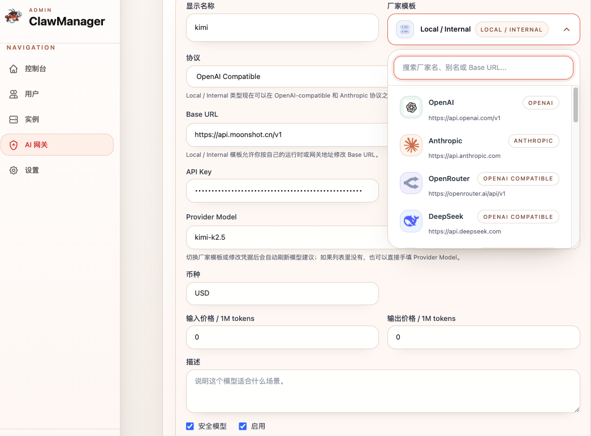
登录后，需要先配置一个可用的**安全模型**，供平台和后续实例统一使用。

1. 点击左侧菜单：**AI 网关** → **模型**。
2. 新增或编辑一个模型，根据你接入的模型服务按实际情况填写以下信息：

   * **显示名称**：填写一个便于识别的名称。
   * **厂商模板**：根据你的模型服务类型选择对应模板；如果使用自定义或兼容接口，可选择 **Local / Internal**。
   * **协议**：根据接口协议选择，例如 **OpenAI Compatible** 或其他实际协议。
   * **Base URL**：填写模型服务提供的接口地址。
   * **API Key**：填写对应模型服务的有效密钥。
   * **Provider Model**：填写实际调用的模型名称。
   * **币种**：按实际情况填写；如无需计费展示，可保持默认。
   * **输入价格 / 输出价格**：如不做计费统计，可先填写 `0`。
3. 提交前务必勾选：

   * **安全模型**
   * **启用**
4. 点击 **保存**。

> 说明：页面中的图片仅用于展示填写位置和示例格式，实际内容请以你所使用的模型服务配置为准。


### 8.3 创建 OpenClaw 实例
模型配置完成后，再创建 **OpenClaw Desktop** 实例。

1. 点击左下角 **ADMIN**，切换到 **工作台**。
2. 点击 **创建实例**。

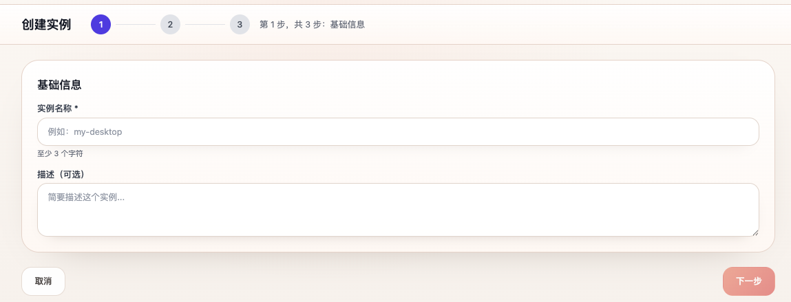
#### 第 1 步：基础信息
- 填写 **实例名称**（至少 3 个字符）。
- 描述可选，不填也可以。
- 点击 **下一步**。

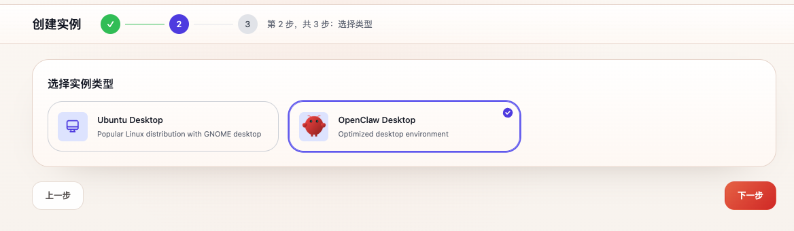
#### 第 2 步：选择类型
- 选择 **OpenClaw Desktop**。
- 点击 **下一步**。


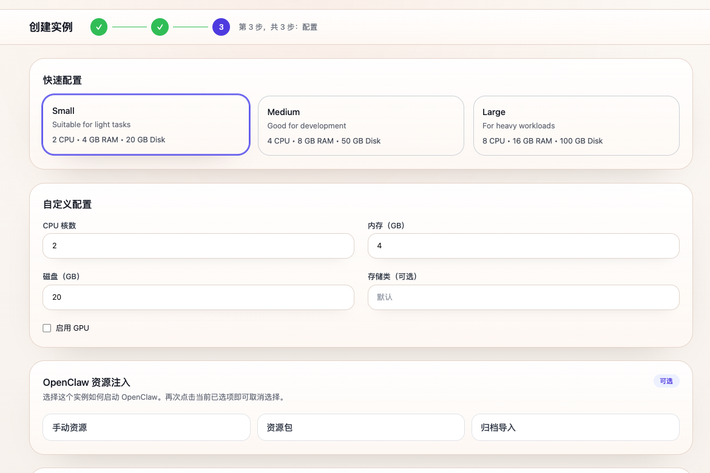
#### 第 3 步：配置
- 可直接选择 **Small** 规格：
  - `2 CPU`
  - `4 GB RAM`
  - `20 GB Disk`
- 也可以在下方自定义配置中按需修改。
- OpenClaw 资源注入部分，可根据需要选择：
  - **手动资源**
  - **资源包**
  - **归档导入**
- 首次使用可先保持默认或选择 **手动资源**。
- 最后点击 **创建**。

### 8.4 首次创建说明
- 第一次创建 **OpenClaw** 实例时，需要下载所需镜像和初始化环境，耗时会明显更长。
- 在网络较慢或首次拉取镜像时，实例状态可能会长时间显示为 **创建中**，请耐心等待。
- 若长时间未启动成功，再回到 Kubernetes / Docker 日志中排查镜像、PVC、网关模型等问题。

---

<a id="sec-12"></a>
## 九、控制台与 AI 网关其他功能说明

除模型配置外，平台首页控制台与 AI 网关还提供审计、成本和规则治理等能力，便于管理员统一查看集群状态、模型调用记录和安全策略执行情况。

### 9.1 控制台总览

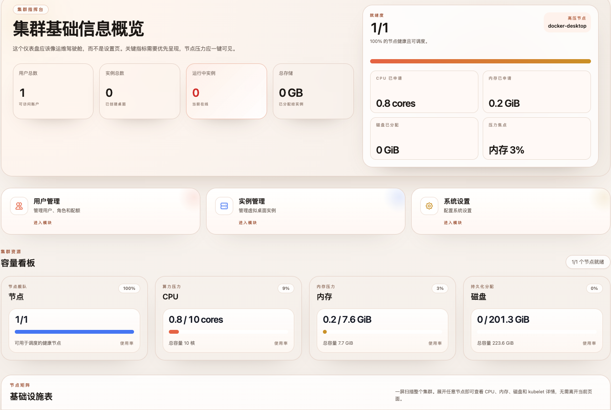

控制台首页用于展示当前集群与平台的整体运行状态，方便管理员快速了解资源使用情况和系统健康状态。

主要包含以下信息：

- **集群基础信息概览**：展示当前平台的用户总数、实例总数、运行中实例数量以及总存储使用情况。
- **节点概览**：展示当前可用节点数量，以及当前集群中主要调度节点信息。
- **资源申请情况**：展示当前平台已申请的 CPU、内存和磁盘资源总量。
- **容量看板**：按节点、CPU、内存、磁盘等维度展示整体资源容量与当前使用率，便于判断集群是否还有可用余量。
- **基础设施表**：用于查看当前节点、资源与基础运行环境的状态信息。

> 说明：控制台主要用于查看平台总体资源、节点和实例运行概况，不直接用于具体实例内的 OpenClaw 操作。

### 9.2 AI 网关功能概览

AI 网关除了“模型”配置外，还包含以下模块：

- **AI 审计**：查看模型调用 Trace、请求与响应负载、命中风险、路由决策以及调用明细。
- **成本**：查看 Token 用量、预估费用、内部成本和趋势统计。
- **风控规则**：配置敏感检测规则，控制命中后是放行还是路由到安全模型。

### 9.3 成本模块

成本页面用于统计平台模型调用的费用与 Token 使用情况，帮助管理员了解整体消耗情况。

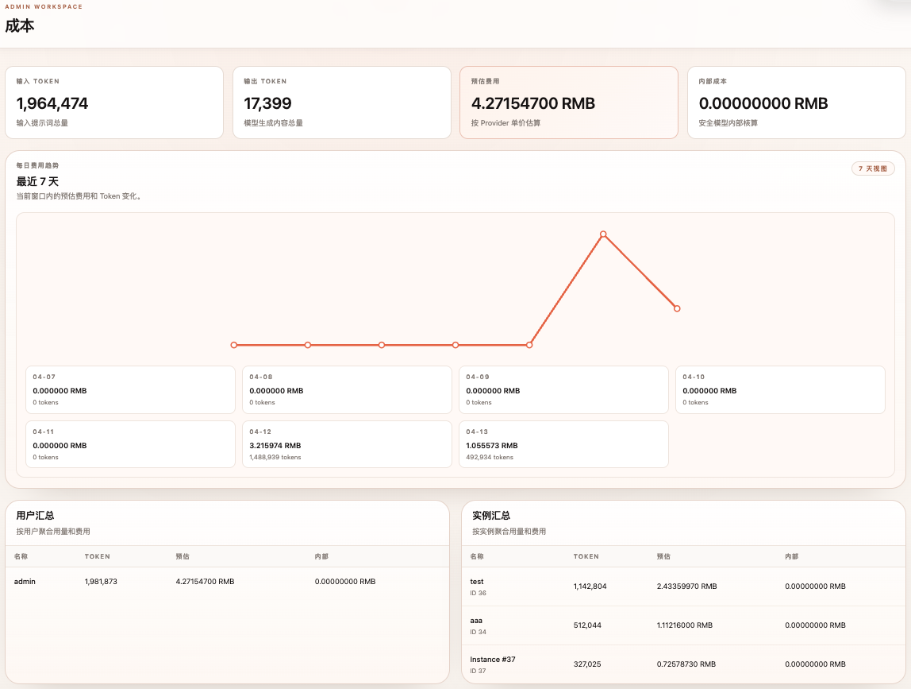

页面主要包括以下内容：

- **输入 Token**：统计输入提示词总量。
- **输出 Token**：统计模型生成内容总量。
- **预估费用**：按 Provider 单价估算的费用。
- **内部成本**：安全模型相关的内部核算成本。
- **每日费用趋势**：按最近 7 天查看当前窗口内的预估费用和 Token 变化。
- **用户汇总**：按用户聚合用量和费用。
- **实例汇总**：按实例聚合用量和费用。
- **最近成本记录**：支持按 Trace、用户、模型等条件搜索并分页查看成本记录，并可进一步跳转到审计详情。

> 说明：如果当前尚未产生模型调用记录，输入 Token、输出 Token、费用及趋势图可能都为 0，这是正常现象。

### 9.4 AI 审计模块

AI 审计页面用于查看最近的受管模型调用记录，帮助管理员排查模型调用、Token 使用和路由结果。

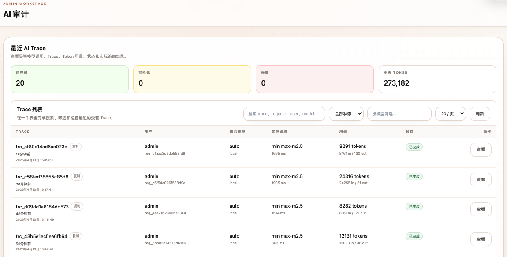

主要功能包括：

- **最近 AI Trace**：查看最近的模型调用链路。
- **Trace 列表**：在统一表格中查看最近的受管 Trace。
- **搜索与筛选**：支持按 Trace、请求内容、用户、模型等条件进行搜索。
- **状态筛选**：支持按状态查看不同调用结果。
- **模型筛选**：支持按模型筛选对应的调用记录。
- **分页刷新**：支持分页查看和手动刷新最新审计结果。

> 说明：如果页面提示“暂无 AI 审计记录”，说明当前尚未产生模型实际调用请求。

### 9.5 风控规则模块

风控规则页面用于配置敏感内容检测规则，并决定命中规则后的处理动作。

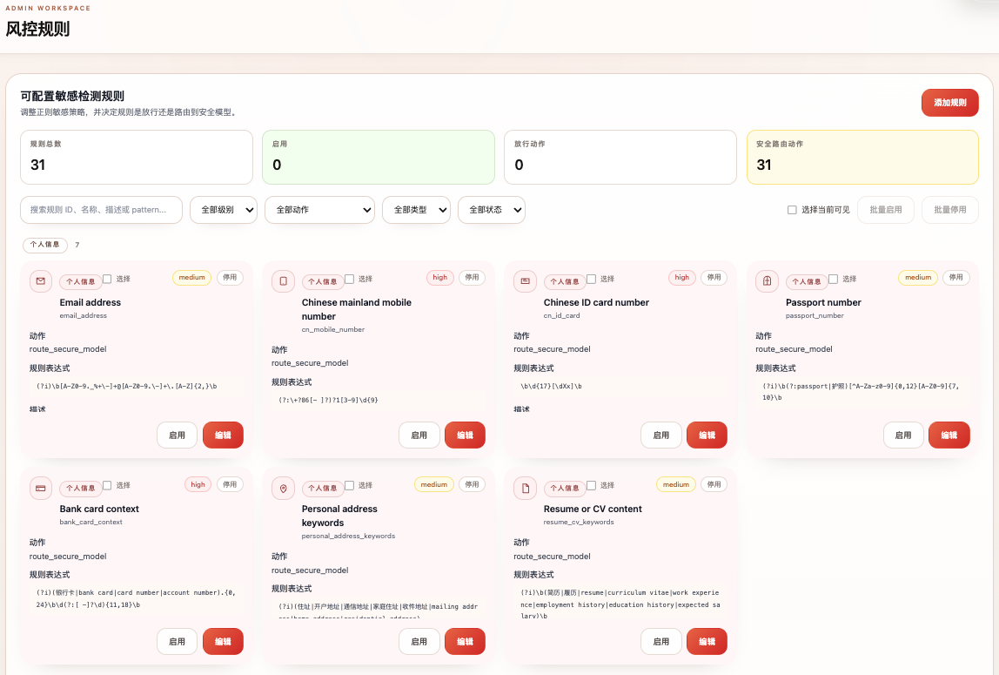

该模块主要支持：

- **规则列表管理**：查看全部规则及其启用状态。
- **规则分类查看**：支持按个人信息、公司信息、客户业务、安全凭据、财务法务、政治敏感、自定义等分类查看规则。
- **规则字段配置**：可设置规则 ID、显示名称、严重级别、动作、排序、正则 Pattern 和描述。
- **规则动作控制**：命中规则后可选择放行，或路由到安全模型。
- **批量启用 / 停用**：支持批量调整规则状态。
- **规则测试台**：可粘贴样本文本，测试启用规则或草稿规则会命中哪些内容。

当前内置规则示例包括但不限于：

- 个人信息：邮箱地址、手机号、身份证号、护照号、银行卡上下文、住址、简历内容等。
- 公司信息：内网 IP、内部域名、主机命名、Kubernetes Service DNS、项目代号、组织架构、薪资 / HR 信息等。
- 客户业务：客户名单、合同 / 报价单、发票税号、CRM / 工单数据等。
- 安全凭据：私钥、API Key、Token、JWT、Cookie / Session、数据库连接串、Kubeconfig、环境变量密钥等。
- 财务法务：预算、利润、营收、法务意见、诉讼、NDA 等。
- 政治敏感：政治机构、军事国家安全、极端暴力相关表述等。

> 说明：默认规则已覆盖多类常见敏感信息检测场景，实际使用中可根据业务需求继续新增、调整或停用部分规则。
---

<a id="sec-13"></a>
## 十、工作台模块说明

工作台是普通用户进入平台后的主要操作区域，用于查看个人资源配额、创建实例、管理实例以及维护 OpenClaw 相关资源。该模块更偏向日常使用与运维操作，与管理员侧的“控制台总览”不同。

### 10.1 工作台首页
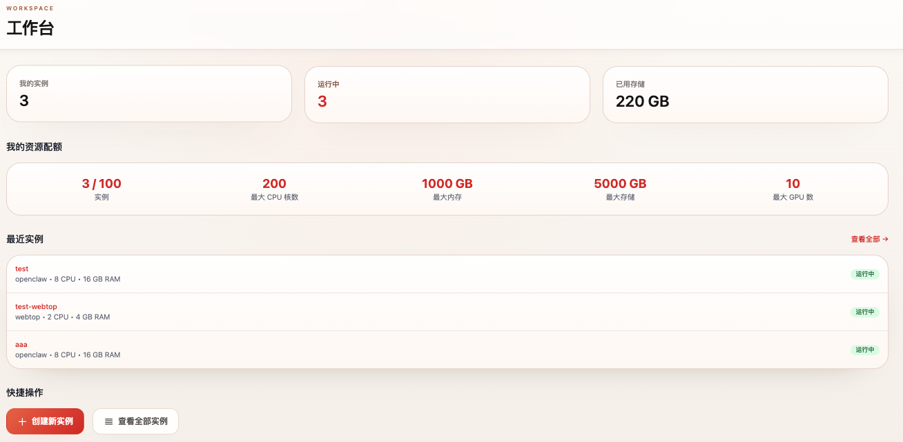
工作台首页用于展示当前账号的实例与资源使用概况，主要包含以下内容：

- **我的实例**：显示当前账号下已创建的实例数量。
- **运行中**：显示当前正在运行的实例数量。
- **已用存储**：显示当前账号已经占用的存储空间。
- **我的资源配额**：展示当前账号可用的配额信息，包括实例数、最大 CPU 核数、最大内存、最大存储以及最大 GPU 数。
- **快捷操作**：提供 **创建新实例** 和 **查看全部实例** 两个入口，便于快速开始使用平台。

> 说明：当页面显示“还没有实例”时，可直接点击 **创建新实例** 开始创建第一个 OpenClaw Desktop 实例。

### 10.2 我的实例

“我的实例”页面用于统一查看和管理当前账号下已创建的实例。该页面主要承担实例管理功能。
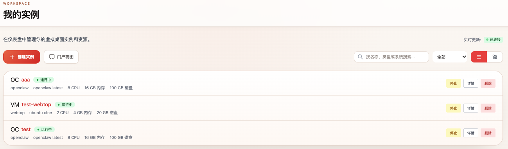
支持的常见操作包括：

- **查看实例状态**：查看实例是否处于创建中、运行中、已停止或异常状态。
- **进入实例详情**：查看实例的基础信息、资源配置和运行情况。
- **停止实例**：当实例运行异常或需要重新加载环境时，可执行停止操作。
- **删除实例**：当实例不再使用时，可直接删除，释放对应的 CPU、内存和存储资源。

> 说明：删除实例后，实例相关资源会被一并清理，执行前请确认其中的数据和配置是否已完成备份。

### 10.3 资源管理

“资源管理”页面用于维护 OpenClaw 可用的资源内容，便于实例在启动后注入和使用。
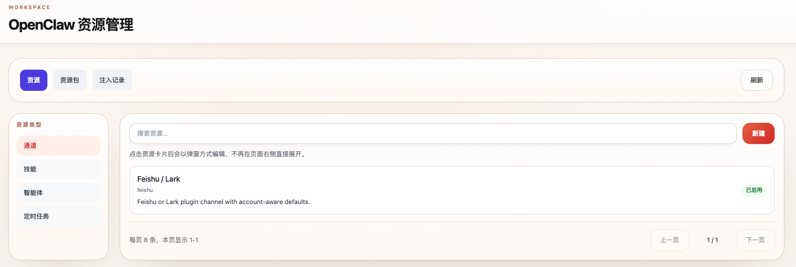
页面主要包括以下部分：

- **资源**：查看和维护可用资源条目。
- **资源包**：将多个资源组合为可复用的资源包，便于批量注入。
- **注入记录**：查看资源注入历史与执行情况。

在资源管理页左侧，还可以按资源类型进行区分管理，当前页面中可见的类型包括：

- **通道**
- **技能**
- **智能体（即将上线）**
- **定时任务（即将上线）**

页面右上角支持：

- **刷新**：重新加载当前资源列表。
- **新建**：创建新的资源项。

> 说明：资源管理主要用于准备实例启动后可使用的 OpenClaw 资源内容，并不直接替代实例创建流程。实例创建时可结合“手动资源”“资源包”“归档导入”等方式进行资源注入。

---

<a id="sec-14"></a>
## 十一、问题与对策速查

<a id="sec-14-storage"></a>
### 11.1 存储问题专项处理（PV/PVC）

如果你看到以下错误：

```text
0/1 nodes are available: pod has unbound immediate PersistentVolumeClaims
```

说明集群存储未自动绑定。此时可以按单机 x86 服务器方式，手动创建本地 `hostPath` PV/PVC。

> 这一方案适合单节点服务器测试或轻量环境；生产环境建议改为 NFS、Ceph、云盘等正式存储。

#### 11.1.1 创建 PV
```bash
kubectl apply -f - <<EOF
apiVersion: v1
kind: PersistentVolume
metadata:
  name: mysql-pv-local
spec:
  capacity:
    storage: 5Gi
  accessModes:
    - ReadWriteOnce
  persistentVolumeReclaimPolicy: Delete
  hostPath:
    path: /tmp/mysql-data
EOF

kubectl apply -f - <<EOF
apiVersion: v1
kind: PersistentVolume
metadata:
  name: minio-pv-local
spec:
  capacity:
    storage: 10Gi
  accessModes:
    - ReadWriteOnce
  persistentVolumeReclaimPolicy: Delete
  hostPath:
    path: /tmp/minio-data
EOF
```

#### 11.1.2 创建 PVC
```bash
kubectl apply -f - <<EOF
apiVersion: v1
kind: PersistentVolumeClaim
metadata:
  name: mysql-data
  namespace: clawmanager-system
spec:
  storageClassName: ""
  accessModes:
    - ReadWriteOnce
  resources:
    requests:
      storage: 5Gi
  volumeName: mysql-pv-local
EOF

kubectl apply -f - <<EOF
apiVersion: v1
kind: PersistentVolumeClaim
metadata:
  name: minio-data
  namespace: clawmanager-system
spec:
  storageClassName: ""
  accessModes:
    - ReadWriteOnce
  resources:
    requests:
      storage: 10Gi
  volumeName: minio-pv-local
EOF
```

#### 11.1.3 重建 Pod
```bash
kubectl delete pod --all -n clawmanager-system
```

#### 11.1.4 重新观察状态
```bash
kubectl get pvc -n clawmanager-system
kubectl get pods -n clawmanager-system -w
```

预期应看到：
- `mysql-data` / `minio-data` 为 `Bound`
- `mysql` / `minio` / `skill-scanner` / `clawmanager-app` 最终为 `Running`

---

| 现象 | 原因 | 处理 |
| :--- | :--- | :--- |
| `kubectl` 连接 `localhost:8080` 被拒绝 | kubeconfig 未配置 | 设置 `KUBECONFIG` 或复制到 `~/.kube/config` |
| Pod 拉镜像超时 | 网络到 Docker Hub / GHCR 不稳定 | 配置镜像加速或代理 |
| MySQL / MinIO 一直 `Pending` | PVC 未绑定 | 检查 `StorageClass` 或手动创建 PV/PVC |
| 浏览器打不开页面 | NodePort 未放通 / `port-forward` 进程未保持 | 放行端口或保持转发终端运行 |
| 页面能打开但无法创建 OpenClaw 实例 | 未配置安全模型 | 先在 **AI 网关 → 模型** 中配置并启用安全模型 |
| 实例长时间“创建中” | 首次拉镜像耗时长 / 存储或网络问题 | 耐心等待，必要时检查 Pod 和事件 |

---

<a id="sec-15"></a>
## 十二、建议的最终检查顺序（可按此自查）
1. `kubectl get nodes`
2. `kubectl get storageclass`
3. `kubectl get pods -n clawmanager-system`
4. `kubectl get pvc -n clawmanager-system`
5. `kubectl get svc -n clawmanager-system`
6. 浏览器访问 `https://<IP>:30443`
7. 登录后台并完成 **安全模型配置**
8. 在工作台中创建 **OpenClaw Desktop** 实例
